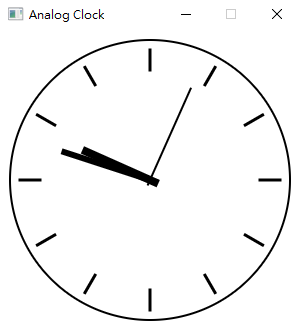
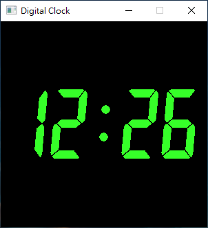

# JavaFX example

[https://github.com/saladlam/javafx-example](https://github.com/saladlam/javafx-example)

## Prerequisite

- Java SE Development Kit 11 or above
- JavaFX 11

## Example

### Analog Clock

Class: info.saladlam.example.javafx.clock.AnalogClock

show how to use JavaFX library to draw clock panel and needle

### Digital Clock

Class: info.saladlam.example.javafx.clock.DigitalClock

show how to make change by using sequence of images
